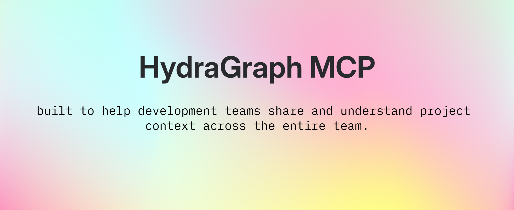

<p align="center">
  
</p>

# HydraGraph MCP

AI coding agents such as Claude Code and Codex usually answer “what depends on this?” by searching for similar text and inferring the result. HydraGraph instead parses a real codebase into a structural call graph, persists that graph in HydraDB, and exposes it through MCP. The agent receives verified callers, callees, source locations, and change-impact paths instead of guesses—including dependencies that cross from a frontend `fetch()` call to the matching backend route.

## Why HydraDB

HydraDB makes the code graph persistent and independently queryable; it is not a temporary cache rebuilt privately by an agent during each session. HydraGraph uses the self-hosted [HydraDB OSS](https://github.com/hydra-db/hydradb) container and its OpenCypher HTTP endpoint:

```text
POST /v1/graphs/{graph_id}/query
```

AST-derived nodes and `CONTAINS`, `IMPORTS`, `CALLS`, and `CALLS_API` relationships are written with parameterized OpenCypher queries. MCP tools then query those stored relationships for direct and transitive dependency evidence.

## Quick start

Requirements: Node.js 20+, npm, Docker Desktop, and PowerShell. The bundled HydraDB launcher binds its HTTP, Bolt, and admin ports to localhost only.

```powershell
git clone https://github.com/sayan365/hydragraph-mcp.git hydragraph
cd hydragraph
npm install
npm run build

# Start the self-hosted HydraDB OSS container and configure its local-only token.
npm run hydradb:start
$env:HYDRADB_TOKEN = "local-development-token-32-bytes"

# Expose the package's `hydragraph` executable on your local npm path.
npm link

hydragraph init

# Use any local TypeScript repository, or clone the verified Docwise target.
git clone https://github.com/sayan365/docwise.git ../target-docwise
hydragraph add ../target-docwise

# Starts the existing MCP stdio server; it waits silently for an MCP client.
hydragraph mcp
```

`hydragraph init` checks HydraDB and writes `.hydragraph/config.json`. `hydragraph add` replaces the generated code graph with data from the supplied repository. Run one repository per configured HydraDB graph.

An MCP client normally launches `hydragraph mcp` itself, so do not also keep a separate copy running. For Codex, add this to `~/.codex/config.toml` and replace the launcher path with the absolute path on your machine:

```toml
[mcp_servers.hydragraph]
command = "node"
args = ["C:\\absolute\\path\\to\\hydragraph\\bin\\hydragraph.js", "mcp"]
env = { HYDRADB_URL = "http://127.0.0.1:8443", HYDRADB_TOKEN = "local-development-token-32-bytes", HYDRADB_NAMESPACE = "default" }
```

The equivalent project-level `.mcp.json` configuration for Claude Code is:

```json
{
  "mcpServers": {
    "hydragraph": {
      "type": "stdio",
      "command": "node",
      "args": [
        "C:\\absolute\\path\\to\\hydragraph\\bin\\hydragraph.js",
        "mcp"
      ],
      "env": {
        "HYDRADB_URL": "http://127.0.0.1:8443",
        "HYDRADB_TOKEN": "local-development-token-32-bytes",
        "HYDRADB_NAMESPACE": "default"
      }
    }
  }
}
```

Restart the client after adding the configuration. The token shown above is the fixed credential generated by the localhost-only development launcher, not a production secret.

## What it does today

- `find_callers(symbol)` returns the code nodes that directly call an exact qualified symbol or HTTP route, with relationship and call-site evidence.
- `impact_of_change(symbol)` walks incoming `CALLS` and `CALLS_API` relationships to return the transitive blast radius with depths and source locations.
- `explain_context(question)` matches a natural-language question to a graph symbol and returns its callers, callees, evidence, and two-hop impact for the calling agent to reason over.

This verified question demonstrates the frontend-to-backend boundary:

```text
explain_context("what would break in the frontend if the /api/analyze-document response format changed?")
```

Relevant output from the live Docwise graph:

```json
{
  "matchedSymbol": "api._backend.route.POST./api/analyze-document",
  "callers": [
    {
      "caller": "src.context.DocumentContext.DocumentProvider.analyzeWithAI",
      "file": "src/context/DocumentContext.tsx",
      "line": 140,
      "relationship": "CALLS_API",
      "evidence": "src/context/DocumentContext.tsx:154 fetch(\"/api/analyze-document\")"
    }
  ],
  "impact": [
    {
      "symbol": "src.context.DocumentContext.DocumentProvider.analyzeWithAI",
      "depth": 1,
      "relationship": "CALLS_API"
    },
    {
      "symbol": "src.context.DocumentContext.DocumentProvider.scanDocumentFile",
      "depth": 2,
      "relationship": "CALLS"
    }
  ]
}
```

## Reference run: real numbers

The verified target is [sayan365/docwise](https://github.com/sayan365/docwise), a real TypeScript/React document-analysis application.

```text
Parsed 27 files, 92 nodes, 165 edges
65 CONTAINS
45 IMPORTS
51 CALLS
4 CALLS_API
6 Express route nodes
449 external or ambiguous calls left unresolved
0 static fetch calls left unresolved
```

## Current scope

- TypeScript and TSX parsing only.
- 51 of 500 ordinary call sites resolve to internal `CALLS` edges (about 10%); the 449 unresolved sites are primarily external or ambiguous and are never guessed.
- One repository per configured HydraDB graph.
- `CALLS_API` matches static `fetch()` paths to Express routes by path string; dynamic paths, Axios, GraphQL, and response-schema analysis are not modeled.
- `explain_context` returns a two-hop impact view by default.

## Roadmap — not built yet

- Multi-project graphs and project-aware namespacing.
- Hosted or remote MCP instances per project.
- Parsers for additional programming languages.
- Team-wide context spanning services owned by different developers.

## Architecture

```text
┌──────────────────────┐    ┌─────────────────────┐    ┌──────────────────────┐
│ Target TS/TSX repo   │───▶│ tree-sitter parser  │───▶│ Self-hosted HydraDB  │
│ src/ + api/          │    │ nodes + call edges  │    │ persisted OpenCypher │
└──────────────────────┘    └─────────────────────┘    └──────────┬───────────┘
                                                                 │
                                                                 ▼
                                                      ┌──────────────────────┐
                                                      │ HydraGraph MCP stdio │
                                                      │ three graph tools    │
                                                      └──────────┬───────────┘
                                                                 │
                                                                 ▼
                                                      ┌──────────────────────┐
                                                      │ Claude Code / Codex  │
                                                      │ reasons over evidence│
                                                      └──────────────────────┘
```

## Tech stack and attribution

- [TypeScript](https://www.typescriptlang.org/) on [Node.js](https://nodejs.org/).
- [tree-sitter](https://tree-sitter.github.io/tree-sitter/) with [`tree-sitter-typescript`](https://github.com/tree-sitter/tree-sitter-typescript) for TypeScript/TSX AST parsing.
- [HydraDB](https://github.com/hydra-db/hydradb), AGPL-3.0, as the self-hosted graph database and OpenCypher query engine.
- [Model Context Protocol TypeScript SDK](https://github.com/modelcontextprotocol/typescript-sdk) for the stdio MCP server and tools.
- [Zod](https://zod.dev/) for MCP tool input schemas.
- [Docwise](https://github.com/sayan365/docwise) as the real validation target; it is not redistributed here.

HydraGraph MCP is available under the [MIT License](LICENSE). Implementation status and evidence are tracked in [docs/PRD.md](docs/PRD.md).
